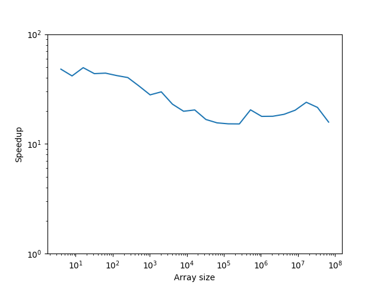

About
-----

Sometimes you just want to compute simple 1D or 2D histograms. Fast. No
nonsense. [Numpy's](http://www.numpy.org) histogram functions are versatile,
and can handle for example non-regular binning, but this versatility comes at
the expense of performance.

The **fast-histogram** mini-package aims to provide simple and fast histogram
functions that don't compromise on performance. It doesn't do anything
complicated - it just implements a simple histogram algorithm in Cython and
keeps it simple. The aim is to have functions that are fast but also robust and
reliable.

To install:

    pip install fast-histogram

Why make a package specifically for this rather than just including Cython code
in packages that need it? The main motivation is to avoid making pure-Python
packages into packages that require compilation just because of the need to
compute histograms.

Example
-------

Here's an example of binning 10 million points into a regular 2D histogram::

    In [1]: import numpy as np

    In [2]: x = np.random.random(10_000_000)

    In [3]: y = np.random.random(10_000_000)

    In [4]: %timeit _ = np.histogram2d(x, y, range=[[-1, 2], [-2, 4]], bins=30)
    1.02 s ± 14.6 ms per loop (mean ± std. dev. of 7 runs, 1 loop each)

    In [5]: from fast_histogram.histogram import histogram2d

    In [6]: %timeit _ = histogram2d(x, y, 30, -1, 2, 30, -2, 4)
    56.1 ms ± 2.57 ms per loop (mean ± std. dev. of 7 runs, 10 loops each)

The version here is almost 20 times faster! The following plot shows the
speedup as a function of array size for the bin parameters shown above:

As you can see, for smaller arrays the performance improvement is even larger,
on the order of 40x.

Contributing
------------

There are several ways in which this small package could be improved. First,
we might be able to speed things up even further, for example with
multi-threading or parallelization. However, I want to make sure that the
package remains as easy to install as robust as possible, so any improvements
should be done with this in mind.
